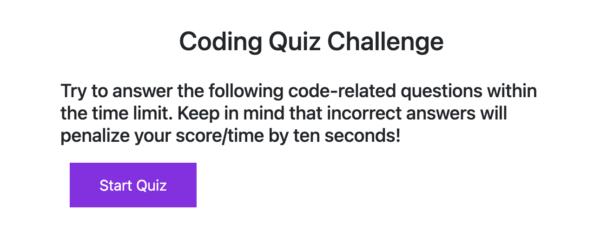

# Challenge Four - Quiz

## Purpose
The purpose of this site is test the user on quiz questions related to JavaScript fundamentals

The user is given instructions letting them know that this is a timed quiz and for every question wrong they will have 10 seconds deducted from the 75 second timer. 

Using an array of objects for the questions and answers allows for the questions to have different multiple choice answer counts.

[GitHub Challenge 4 Live Site](https://drewsparker.github.io/challengeFourQuiz/)

## Future Enhancements
- Some areas for potential improvement include timer resetting for when user clicks back in the browser.
- Verifying that the initials entered match the correct format.
